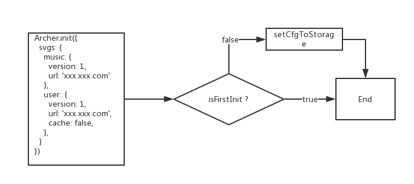
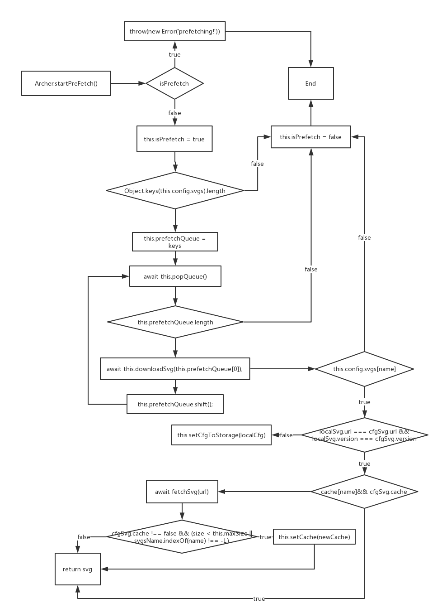
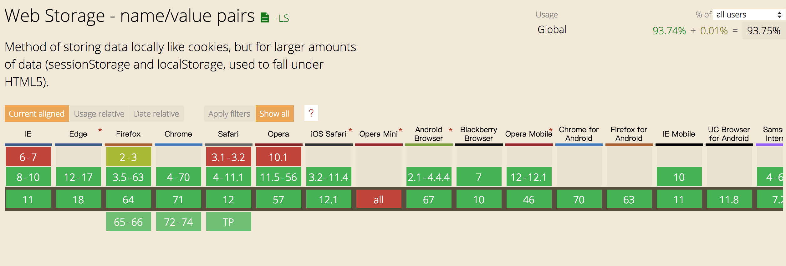

<h1 align='center'>archer-svgs</h1>
<p align='center'>
  <a href="https://travis-ci.com/ShanaMaid/archer-svgs/">
    
  </a>
  
  
  
  
  
  <a href='https://blog.shanamaid.top/archer-svgs/'></a>
</p>

[English](./README.md) | 🇨🇳简体中文

> 哇哦！无限的svgs!你可以使用`archer-svgs`去异步加载svg并将它缓存在`localStorage`里，当你再次使用已经加载过的svg时将不需要再发起http请求。将svgs从你的js-bunlde里移除，并且永远减小js-bunlde的体积


> 如果你觉得这个项目还不错，可以给我一个`star`和`follow`来支持我 😘

## [在线示例](https://blog.shanamaid.top/archer-svgs/)
## 目录
* [安装](#安装)
  * [npm](#npm)
  * [yarn](#yarn)
* [特性](#特性)
* [设计思路](#设计思路)
  * [配置初始化](#配置初始化)
  * [预加载](#预加载)
* [兼容性](#兼容性)
* [方法](#方法)
  * [init( )](#init)
  * [startPrefetch( )](#startprefetch)
  * [downloadSvg( )](#downloadsvg)
  * [clearSvgCache( )](#clearsvgcache)
  * [setMaxSize( )](#setmaxsize)
  * [setMax( )](#setmax)
  * [fetchSvg( )](#fetchsvg)
* [用法](#用法)
  * React
  * Vue
* [谁在用？](#谁在用)
* [贡献者](#贡献者)


### 安装
#### npm
```bash
npm install archer-svgs
```
#### yarn
```bash
yarn add archer-svgs
```

### 特性
- 使用`TypeScript`进行, 提供 `d.ts` 文件提高开发效率。
- 异步加载 `svg`
- 缓存 `svg` 在 `localstorage` 或者 `disk-cache`
- 已经缓存`svg`在再次使用的时候不用发起`http`请求
- 体积小
- 预加载 `svg`

### 设计思路
#### 配置初始化


### 预加载


### 兼容性
`archer-svgs` 基于`fetch`和`localStorage`.针对`fetch`, 采用了 [whatwg-fetch](https://github.com/github/fetch)去做兼容!换句话说, 只要你的浏览器支持 `xhr`和`localStorage`，你就可以使用它!他们的兼容性如下图所示：



### 方法
#### init()
必须先调用 `init()`，然后才能使用其它的`Archer`方法!
```js
import Archer from 'archer-svgs';

Archer.init({
  svgs: {
    'ios-airplane': {
      url: 'https://unpkg.com/ionicons@4.4.2/dist/ionicons/svg/ios-airplane.svg',
      version: 1,
    },
    'md-airplane': {
      url: 'https://unpkg.com/ionicons@4.4.2/dist/ionicons/svg/md-airplane.svg',
      version: 1,
      cache: false,
    },
  }
})
```
config - `paramas`
```js
export interface IConfig {
  svgs: ISVG;
}

export interface ISVG {
  [index: string]: {
    version: number | string; // svg version
    url: string; // svg url
    cache?: boolean; // default: true. false: not cache svg in localStorage 
  }
}
```

#### startPrefetch()
`startPrefetch`会对`config`中的`svg`进行预加载!当你调用`svg`的时候将大大提高使用速度。

原因：
- disk cache
- localStorage cache

```js
import Archer from 'archer-svgs';

Archer.init(...);
Archer.startPrefetch();
```

#### downloadSvg()
`params`是`config.svgs`的`key`, 这个方法将返回`svg`的内容。
```js
import Archer from 'archer-svgs';

Archer.init({
  svgs: {
    'ios-airplane': {
      url: 'https://unpkg.com/ionicons@4.4.2/dist/ionicons/svg/ios-airplane.svg',
      version: 1,
    },
  }
})

console.log(Archer.downloadSvg('ios-airplane'));
```
`result:`
```js
<svg xmlns="http://www.w3.org/2000/svg" viewBox="0 0 512 512"><path d="M407.7 224c-3.4 0-14.8.1-18 .3l-64.9 1.7c-.7 0-1.4-.3-1.7-.9L225.8 79.4c-2.9-4.6-8.1-7.4-13.5-7.4h-23.7c-5.6 0-7.5 5.6-5.5 10.8l50.1 142.8c.5 1.3-.4 2.7-1.8 2.7L109 230.1c-2.6.1-5-1.1-6.6-3.1l-37-45c-3-3.9-7.7-6.1-12.6-6.1H36c-2.8 0-4.7 2.7-3.8 5.3l19.9 68.7c1.5 3.8 1.5 8.1 0 11.9l-19.9 68.7c-.9 2.6 1 5.3 3.8 5.3h16.7c4.9 0 9.6-2.3 12.6-6.1L103 284c1.6-2 4.1-3.2 6.6-3.1l121.7 2.7c1.4.1 2.3 1.4 1.8 2.7L183 429.2c-2 5.2-.1 10.8 5.5 10.8h23.7c5.5 0 10.6-2.8 13.5-7.4L323.1 287c.4-.6 1-.9 1.7-.9l64.9 1.7c3.3.2 14.6.3 18 .3 44.3 0 72.3-14.3 72.3-32S452.1 224 407.7 224z"/></svg>
```
### clearSvgCache()
清理掉`localStorage`中`svg`的缓存。
```js
import Archer from 'archer-svgs';

Archer.clearCache();
```

### setMaxSize()
设置`localStorage`中`svg`的缓存最大值，单位是`kb`。
```js
import Archer from 'archer-svgs';

Archer.setMaxSize(1024); // 1024kb
```

### setMax()
设置`localStorage`中`svg`的缓存数量。
```js
import Archer from 'archer-svgs';

Archer.setMax(10); // 你可以在loaclStorage中缓存10个svg
```
### fetchSvg()
通过`url`加载`svg`。
```js
import Archer from 'archer-svgs';

const svg = Archer.fetchSvg('https://unpkg.com/ionicons@4.4.2/dist/ionicons/svg/ios-airplane.svg')

console.log(svg);
```
`result:`
```js
<svg xmlns="http://www.w3.org/2000/svg" viewBox="0 0 512 512"><path d="M407.7 224c-3.4 0-14.8.1-18 .3l-64.9 1.7c-.7 0-1.4-.3-1.7-.9L225.8 79.4c-2.9-4.6-8.1-7.4-13.5-7.4h-23.7c-5.6 0-7.5 5.6-5.5 10.8l50.1 142.8c.5 1.3-.4 2.7-1.8 2.7L109 230.1c-2.6.1-5-1.1-6.6-3.1l-37-45c-3-3.9-7.7-6.1-12.6-6.1H36c-2.8 0-4.7 2.7-3.8 5.3l19.9 68.7c1.5 3.8 1.5 8.1 0 11.9l-19.9 68.7c-.9 2.6 1 5.3 3.8 5.3h16.7c4.9 0 9.6-2.3 12.6-6.1L103 284c1.6-2 4.1-3.2 6.6-3.1l121.7 2.7c1.4.1 2.3 1.4 1.8 2.7L183 429.2c-2 5.2-.1 10.8 5.5 10.8h23.7c5.5 0 10.6-2.8 13.5-7.4L323.1 287c.4-.6 1-.9 1.7-.9l64.9 1.7c3.3.2 14.6.3 18 .3 44.3 0 72.3-14.3 72.3-32S452.1 224 407.7 224z"/></svg>
```
## 用法
- [React](https://github.com/ShanaMaid/archer-svgs/blob/master/demo/components/Icon/index.tsx)
- Vue

## 谁在用
- [Yoshino](https://github.com/Yoshino-UI/Yoshino)

## 贡献者

## archer-svgs 受到以下项目启发
- [ionicons](https://github.com/ionic-team/ionicons)