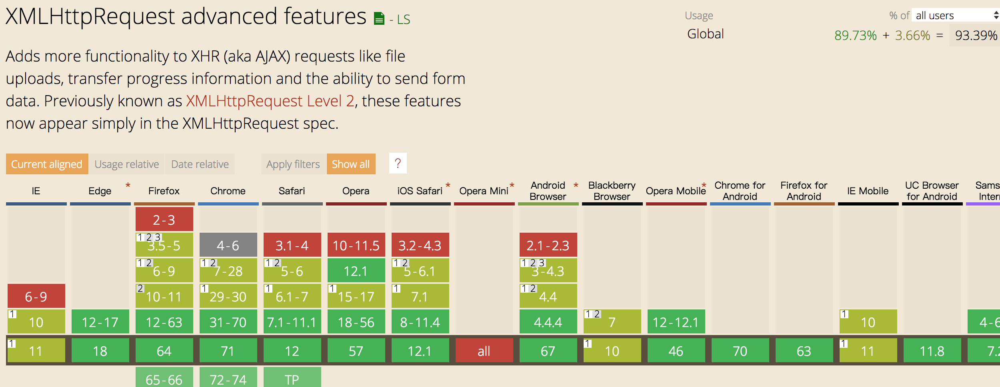

<h1 align='center'>archer-svgs</h1>
<p align='center'>
  <a href="https://travis-ci.com/ShanaMaid/archer-svgs/">
    
  </a>
  
  
  
  
  
  <a href='https://blog.shanamaid.top/archer-svgs/'></a>
</p>

# 背景
 实际生产项目中基本都会用到`svg`，随着项目迭代`svg bundle`的体积会越来越大，在后续迭代中如果每新增或删除一个`svg`就会导致`svg`bundle的hash发生变化，用户就必须重新下载这个文件，为此会付出额外的流量开支。例如，现在有一个`svg`bundle为`100kb`，此时新增了一个`1kb`的`svg`，项目上线后，用户就需要为这`1kb`的更新重新加载整个`svg bundle`，即`101kb`，毫无疑问，这是一种非常愚蠢的行为。这种方式还存在另一个问题，当两个不同的项目拥有相同的`svg bundle`时，由于`svg bundle`资源在不同域下，用户需要下载2份资源。`archer-svgs`就是为了解决这个问题，通过它你可以更灵活、轻便地加载svg。

> 如果你觉得这个项目还不错，可以给我一个`star`和`follow`来支持我 😘

## [在线示例](https://blog.shanamaid.top/archer-svgs/)
## 目录
* [安装](#安装)
  * [npm](#npm)
  * [yarn](#yarn)
  * [script](#script)
* [性能](#性能)
* [特性](#特性)
* [兼容性](#兼容性)
* [方法](#方法)
  * [set( )](#set)
  * [startPrefetch( )](#startprefetch)
  * [downloadSvg( )](#downloadsvg)
  * [fetchSvg( )](#fetchsvg)
  * [setThreadNum( )](#setthreadnum)
* [注意](#注意)
* [用法](#用法)
  * [React](#react)
  * Vue
* [谁在用？](#谁在用)
* [贡献者](#贡献者)


### 安装
#### npm
```bash
npm install archer-svgs
```
#### yarn
```bash
yarn add archer-svgs
```

#### script
```html
<script src="//unpkg.com/archer-svgs/lib/Archer.min.js"></script>
```

### 性能
`svg`资源的加载顺序为`内存->硬盘缓存->远程服务器资源`，大大提高资源加载效率。

如果想进一步提高加载速度，可以将`svg`资源放在`cdn`上。

同时由于`svg`资源是通过`url`进行加载的，因此可以跨域共享`diskCache`。

### 特性
- 使用`TypeScript`进行, 提供`d.ts`文件提高开发效率。
- 通过`XMLHttpRequest`异步加载 `svg`
- 高效率加载svg，加载顺序：内存->diskCache->远程服务器
- 体积小
- 支持预加载 `svg`

### 兼容性
`archer-svgs` 基于`XMLHttpRequest`， 只要你的浏览器支持 `xhr`，你就可以使用它!兼容性如下图所示：


如果需要在[低版本浏览器](http://caniuse.com/#feat=promises)使用，需要引入`promises poly-fill`，
推荐使用[taylorhakes/promise-polyfill](https://github.com/taylorhakes/promise-polyfill)，体积小并且兼容性很好。
你也可以使用`<script>`去加载它。

```js
<script src="https://cdn.jsdelivr.net/npm/promise-polyfill@8/dist/polyfill.min.js"></script>
```


### 方法
#### set()
必须先调用 `set()`初始化配置，然后才能使用其它的`Archer`方法!
```js
import Archer from 'archer-svgs';

const archer = new Archer();

archer.set({
  'ios-airplane': 'https://unpkg.com/ionicons@4.4.2/dist/ionicons/svg/ios-airplane.svg',
  'md-airplane': 'https://unpkg.com/ionicons@4.4.2/dist/ionicons/svg/md-airplane.svg',
})
```
config - `paramas`
```js
export interface IConfig {
  [index: string]: string;
}

```

#### add()
添加配置
```jsx
archer.set({
  'ios-airplane': 'https://unpkg.com/ionicons@4.4.2/dist/ionicons/svg/ios-airplane.svg',
})
archer.add({
  'md-airplane': 'https://unpkg.com/ionicons@4.4.2/dist/ionicons/svg/md-airplane.svg',
})
/**
 * config = {
 *  'ios-airplane': 'https://unpkg.com/ionicons@4.4.2/dist/ionicons/svg/ios-airplane.svg',
 *  'md-airplane': 'https://unpkg.com/ionicons@4.4.2/dist/ionicons/svg/md-airplane.svg',
 * }
 * /
```
#### startPrefetch()
`startPrefetch`会对`config`中的`svg`进行预加载!当你调用`svg`的时候将大大提高使用速度。

- 当`diskCache`为空时，从远程服务资源拉取资源，同时将资源缓存到`memory`和`diskCache`中。
- 当`diskCache`不为空时，将本地资源加载到`memory`中。

```js
archer.startPrefetch();
```

#### downloadSvg()
`params`是`config.svgs`的`key`, 这个方法将返回`svg`的内容。
```js
console.log(archer.downloadSvg('ios-airplane'));
```
`result:`
```js
<svg xmlns="http://www.w3.org/2000/svg" viewBox="0 0 512 512"><path d="M407.7 224c-3.4 0-14.8.1-18 .3l-64.9 1.7c-.7 0-1.4-.3-1.7-.9L225.8 79.4c-2.9-4.6-8.1-7.4-13.5-7.4h-23.7c-5.6 0-7.5 5.6-5.5 10.8l50.1 142.8c.5 1.3-.4 2.7-1.8 2.7L109 230.1c-2.6.1-5-1.1-6.6-3.1l-37-45c-3-3.9-7.7-6.1-12.6-6.1H36c-2.8 0-4.7 2.7-3.8 5.3l19.9 68.7c1.5 3.8 1.5 8.1 0 11.9l-19.9 68.7c-.9 2.6 1 5.3 3.8 5.3h16.7c4.9 0 9.6-2.3 12.6-6.1L103 284c1.6-2 4.1-3.2 6.6-3.1l121.7 2.7c1.4.1 2.3 1.4 1.8 2.7L183 429.2c-2 5.2-.1 10.8 5.5 10.8h23.7c5.5 0 10.6-2.8 13.5-7.4L323.1 287c.4-.6 1-.9 1.7-.9l64.9 1.7c3.3.2 14.6.3 18 .3 44.3 0 72.3-14.3 72.3-32S452.1 224 407.7 224z"/></svg>
```

#### fetchSvg()
通过`url`加载`svg`。
```js
const svg = archer.fetchSvg('https://unpkg.com/ionicons@4.4.2/dist/ionicons/svg/ios-airplane.svg')

console.log(svg);
```
`result:`
```js
<svg xmlns="http://www.w3.org/2000/svg" viewBox="0 0 512 512"><path d="M407.7 224c-3.4 0-14.8.1-18 .3l-64.9 1.7c-.7 0-1.4-.3-1.7-.9L225.8 79.4c-2.9-4.6-8.1-7.4-13.5-7.4h-23.7c-5.6 0-7.5 5.6-5.5 10.8l50.1 142.8c.5 1.3-.4 2.7-1.8 2.7L109 230.1c-2.6.1-5-1.1-6.6-3.1l-37-45c-3-3.9-7.7-6.1-12.6-6.1H36c-2.8 0-4.7 2.7-3.8 5.3l19.9 68.7c1.5 3.8 1.5 8.1 0 11.9l-19.9 68.7c-.9 2.6 1 5.3 3.8 5.3h16.7c4.9 0 9.6-2.3 12.6-6.1L103 284c1.6-2 4.1-3.2 6.6-3.1l121.7 2.7c1.4.1 2.3 1.4 1.8 2.7L183 429.2c-2 5.2-.1 10.8 5.5 10.8h23.7c5.5 0 10.6-2.8 13.5-7.4L323.1 287c.4-.6 1-.9 1.7-.9l64.9 1.7c3.3.2 14.6.3 18 .3 44.3 0 72.3-14.3 72.3-32S452.1 224 407.7 224z"/></svg>
```
#### setThreadNum
设置预加载`svg`的最大并发下载数，默认值是`2`。

例如修改最大并发量为`5`。
```js
archer.setThreadNum(5);
```

### 注意
跨域加载svg静态资源的时候需要服务端配置`Access-Control-Allow-Origin`。

### 用法
#### React
```js
import Icon from 'archer-svgs/lib/react';

// 初始化配置
Icon.archer.set({
  'ios-airplane': 'https://unpkg.com/ionicons@4.4.2/dist/ionicons/svg/ios-airplane.svg',
});

// 预加载 - 根据实际需求，也可以不进行预加载

Icon.archer.startPrefetch();

<Icon type="ios-airplane"/>
```
### 谁在用
- [Yoshino](https://github.com/Yoshino-UI/Yoshino)

### 贡献者

### archer-svgs 受到以下项目启发
- [ionicons](https://github.com/ionic-team/ionicons)