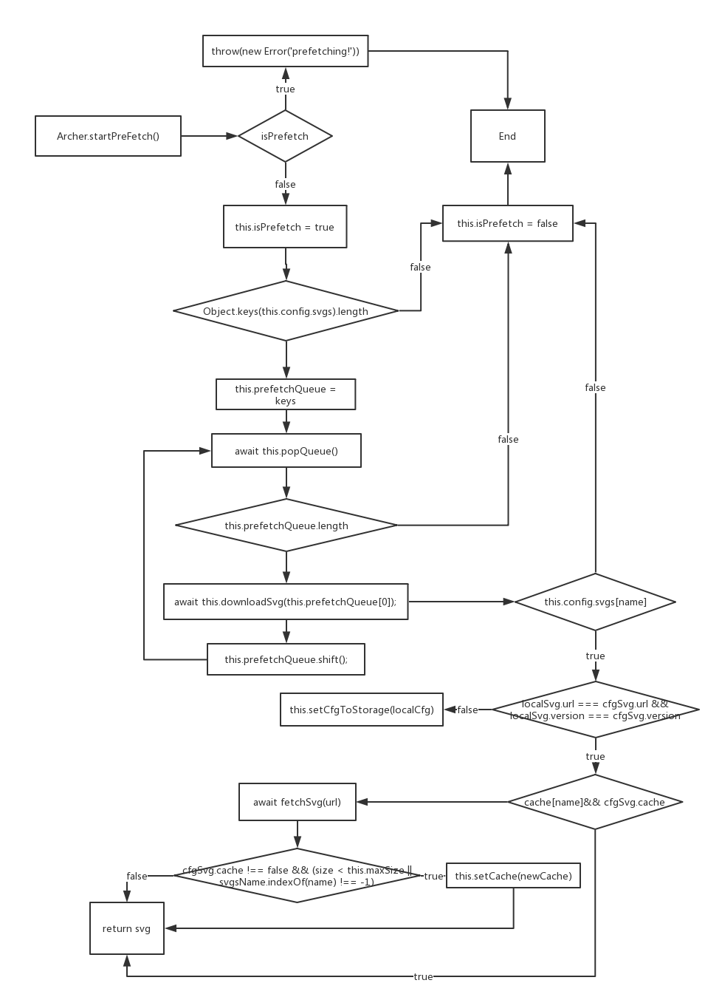
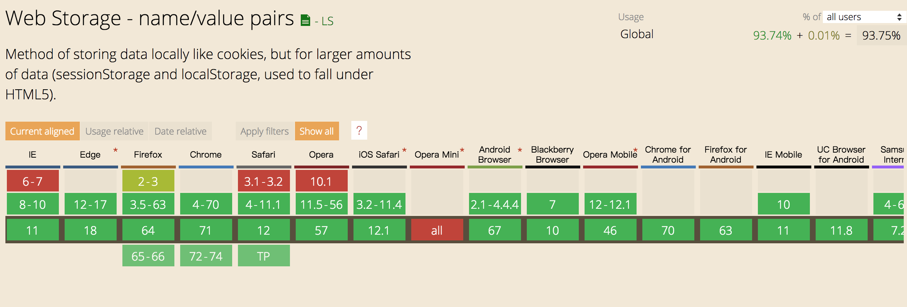

<h1 align='center'>archer-svgs</h1>
<p align='center'>
  <a href="https://travis-ci.com/ShanaMaid/archer-svgs/">
    
  </a>
  
  
  
  
  
  <a href='https://blog.shanamaid.top/archer-svgs/'></a>
</p>

English | [🇨🇳简体中文](./README-cn.md)

> wow, infinite svgs!You can use archer-svgs to load svg async and cache it in local storage, when you reuse svg without http request!Thin your js-bundle forever!


> If you think so, support me with a star and a follow 😘

## Contents
* [Install](#install)
  * [npm](#npm)
  * [yarn](#yarn)
* [Feature](#feature)
* [How to design?](#how-to-design)
  * [Init config](#init-config)
  * [Prefetch](#prefetch)
* [Can I use?](#can-i-use)
* [Method](#method)
  * [init( )](#init)
  * [startPrefetch( )](#startprefetch)
  * [downloadSvg( )](#downloadsvg)
  * [clearSvgCache( )](#clearsvgcache)
  * [setMaxSize( )](#setmaxsize)
  * [setMax( )](#setmax)
  * [fetchSvg( )](#fetchsvg)
* [Usage](#usage)
  * React
  * Vue
* [Who use?](#who-use)
* [Contributors](#contributors)


### Install
#### npm
```bash
npm install archer-svgs
```
#### yarn
```bash
yarn add archer-svgs
```

### Feature
- Develop with `TypeScript`, provide `d.ts` files to help developers increase development speed
- Async load `svg`
- Cache `svg` in `localstorage` or `disk-cache`
- Fast reuse `svg` that has caching without http request
- Minisize
- Prefetch `svg`

### How to Design
#### Init Config


### Prefetch


### Can I use?
`archer-svgs` based on `fetch` and `localStorage`.For `fetch`, use [whatwg-fetch](https://github.com/github/fetch) to `polyfill`!In other word, you can use archer-svgs if your brower support `xhr` and `localStorage`!As shown in the figure below:



### Method
#### init()
You must `init()` before using other `Archer` method!
```js
import Archer from 'archer-svgs';

Archer.init({
  svgs: {
    'ios-airplane': {
      url: 'https://unpkg.com/ionicons@4.4.2/dist/ionicons/svg/ios-airplane.svg',
      version: 1,
    },
    'md-airplane': {
      url: 'https://unpkg.com/ionicons@4.4.2/dist/ionicons/svg/md-airplane.svg',
      version: 1,
      cache: false,
    },
  }
})
```
config - `paramas`
```js
export interface IConfig {
  svgs: ISVG;
}

export interface ISVG {
  [index: string]: {
    version: number | string; // svg version
    url: string; // svg url
    cache?: boolean; // default: true. false: not cache svg in localStorage 
  }
}
```

#### startPrefetch()
`startPrefetch` will prefetch svg!It fast get svg when you really use it!
`Why?`
- disk cache
- localStorage cache

```js
import Archer from 'archer-svgs';

Archer.init(...);
Archer.startPrefetch();
```

#### downloadSvg()
`params` is `key` of `config.svgs`, this func will return svg content!
```js
import Archer from 'archer-svgs';

Archer.init({
  svgs: {
    'ios-airplane': {
      url: 'https://unpkg.com/ionicons@4.4.2/dist/ionicons/svg/ios-airplane.svg',
      version: 1,
    },
  }
})

console.log(Archer.downloadSvg('ios-airplane'));
```
`result:`
```js
<svg xmlns="http://www.w3.org/2000/svg" viewBox="0 0 512 512"><path d="M407.7 224c-3.4 0-14.8.1-18 .3l-64.9 1.7c-.7 0-1.4-.3-1.7-.9L225.8 79.4c-2.9-4.6-8.1-7.4-13.5-7.4h-23.7c-5.6 0-7.5 5.6-5.5 10.8l50.1 142.8c.5 1.3-.4 2.7-1.8 2.7L109 230.1c-2.6.1-5-1.1-6.6-3.1l-37-45c-3-3.9-7.7-6.1-12.6-6.1H36c-2.8 0-4.7 2.7-3.8 5.3l19.9 68.7c1.5 3.8 1.5 8.1 0 11.9l-19.9 68.7c-.9 2.6 1 5.3 3.8 5.3h16.7c4.9 0 9.6-2.3 12.6-6.1L103 284c1.6-2 4.1-3.2 6.6-3.1l121.7 2.7c1.4.1 2.3 1.4 1.8 2.7L183 429.2c-2 5.2-.1 10.8 5.5 10.8h23.7c5.5 0 10.6-2.8 13.5-7.4L323.1 287c.4-.6 1-.9 1.7-.9l64.9 1.7c3.3.2 14.6.3 18 .3 44.3 0 72.3-14.3 72.3-32S452.1 224 407.7 224z"/></svg>
```
### clearSvgCache()
It will clear svg cache in localStorage!
```js
import Archer from 'archer-svgs';

Archer.clearCache();
```

### setMaxSize()
Set the max-size(unit: `kb`) of caching svg in `localStorage`!
```js
import Archer from 'archer-svgs';

Archer.setMaxSize(1024); // 1024kb
```

### setMax()
Set the number of caching svg in localStorage!
```js
import Archer from 'archer-svgs';

Archer.setMax(10); // you can cache 10 svgs in localStorage
```
### fetchSvg()
get svg content by `url`.
```js
import Archer from 'archer-svgs';

const svg = Archer.fetchSvg('https://unpkg.com/ionicons@4.4.2/dist/ionicons/svg/ios-airplane.svg')

console.log(svg);
```
`result:`
```js
<svg xmlns="http://www.w3.org/2000/svg" viewBox="0 0 512 512"><path d="M407.7 224c-3.4 0-14.8.1-18 .3l-64.9 1.7c-.7 0-1.4-.3-1.7-.9L225.8 79.4c-2.9-4.6-8.1-7.4-13.5-7.4h-23.7c-5.6 0-7.5 5.6-5.5 10.8l50.1 142.8c.5 1.3-.4 2.7-1.8 2.7L109 230.1c-2.6.1-5-1.1-6.6-3.1l-37-45c-3-3.9-7.7-6.1-12.6-6.1H36c-2.8 0-4.7 2.7-3.8 5.3l19.9 68.7c1.5 3.8 1.5 8.1 0 11.9l-19.9 68.7c-.9 2.6 1 5.3 3.8 5.3h16.7c4.9 0 9.6-2.3 12.6-6.1L103 284c1.6-2 4.1-3.2 6.6-3.1l121.7 2.7c1.4.1 2.3 1.4 1.8 2.7L183 429.2c-2 5.2-.1 10.8 5.5 10.8h23.7c5.5 0 10.6-2.8 13.5-7.4L323.1 287c.4-.6 1-.9 1.7-.9l64.9 1.7c3.3.2 14.6.3 18 .3 44.3 0 72.3-14.3 72.3-32S452.1 224 407.7 224z"/></svg>
```
## Usage
- [React](https://github.com/ShanaMaid/archer-svgs/blob/master/demo/components/Icon/index.tsx)
- Vue

## Who use ?
- [Yoshino](https://github.com/Yoshino-UI/Yoshino)

## Contributors

## archer-svgs is Inspired or Powered By:
- [ionicons](https://github.com/ionic-team/ionicons)